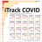

```{r global functions, include=F}
source("covid-functions.R")

library(metathis)
meta() %>%
  meta_description(
    "iTrack COVID App provides LIVE updates on the situation with COVID-19 around the globe and enables automated search of high-risk areas, sorted by pandemic spread Speed, which is the number of new cases a day, and Growth, which is also known as Reproduction Rate or Rt."
  ) %>%
  meta_name("github-repo" = "gorodnichy/itrack-covid") %>%
  meta_viewport() %>%
  meta_social(
    title = "iTrack COVID: Interactive COVID-19 Tracker ",
    url = "https://itrack.shinyapps.io/covid",
    image = "https://itrack.shinyapps.io/covid/covid-48.png",
    image_alt = "iTrack COVID Logo",
    og_type = "app",
    og_author = c("Dmitry Gorodnichy"),
    twitter_card_type = "summary",
    twitter_creator = "@ivim.ca"
  )   %>% 
  meta_general(
    # keywords = "covidcanada, covidontario, covidusa, covid19ontario, covid19ottawa, covid19toronto",
    application_name = "iTrack COVID App",
    theme_color = "#4285f4",
    description = "iTrack COVID App provides LIVE updates on the situation with COVID-19 around the globe and enables automated search of high-risk areas, sorted by pandemic spread Speed, which is the number of new cases a day, and Growth, which is also known as Reproduction Rate or Rt.",
    robots = "index,follow",
    generator = "R-Shiny",
    subject = "iTrack Projects by IVIM (www.ivim.ca)",
    rating = "General",
    referrer = "no-referrer"
  )


```


```{r readCov, include=F}

# read Covid -----

dtJHU <-readCovidJHU() %T>% print; 
dateMaxJHU <- dtJHU$date %>% max (na.rm=T)%>% ymd; dateMaxJHU

dtCa <- readCovidUofT() %T>% print
# dtUS <- readCovidUS() %T>% print
# dateMaxCa <- dtUS$date %>% max  (na.rm=T)%>% ymd; dateMaxCa
# dateMaxUS<- dtUS$date %>% max (na.rm=T) %>% ymd; dateMaxUS

# dtAll <-   dtJHU %>% rbind ( dtCa ) %>% rbind (dtUS)
dtAll <-   dtJHU 

dtAll [, (colsCases):= lapply(.SD, tidyr::replace_na, 0), .SDcol = colsCases]
dtAll[, (colsGeo):=lapply(.SD, iconv, to="ASCII//TRANSLIT"), .SDcols=colsGeo]


# dtAll %>% 
#   dt.replaceAB("state", "BC", "British Columbia"  ) %>% 
#   dt.replaceAB("state",  "NWT", "Northwest Territories" ) %>% 
#   dt.replaceAB("state",  "NL", "Newfoundland and Labrador" ) %>% 
#   dt.replaceAB("state", "PEI", "Prince Edward Island"  )


dateMax <- dtAll$date %>% max (na.rm=T) %>% ymd;  dateMax
dateToday <- format(Sys.time(), '%d %B, %Y') %>% dmy; dateToday

# rm(dtJHU); rm(dtCa); rm(dtUS)


# read Geo -----

if (T) {
  
  dtGeo <- readRDS("dtGeoAll-0.Rds")
  dtGeo$confirmed <- dtGeo$deaths <- NULL
  
  dtGeo[ state == "...COMBINED...", state:=STR_TOTAL]
  dtGeo[city=="...COMBINED...", city:=STR_TOTAL]
  
} else {
  dtGeo <- fread("https://raw.githubusercontent.com/CSSEGISandData/COVID-19/master/csse_covid_19_data/UID_ISO_FIPS_LookUp_Table.csv") %>%
    dt.rmcols (c("UID"  , "iso2" ,   "iso3"  ,   "code3", "FIPS", "Combined_Key"))  %>%
    setnames(c("city", "state", "country", "lat", "lng", "population")) %>% lazy_dt() %>%
    #   filter(state %ni% c ("Diamond Princess", "Grand Princess", "Recovered")) %>%
    as.dt
  
  dtGeo[ state == "", state:=STR_TOTAL]
  dtGeo[ city == "", city:=STR_TOTAL]
  
  setcolorder(dtGeo, c( "country" , "state" , "city" , "lat", "lng" , "population"  ) )
  
  # # canadian Geo------------------------
  # 
  # # dtCaCitiesInUofT <-  dtCa[date == dtCa$date %>% max][city!=STR_TOTAL]
  #   dtCaCitiesInUofT <-  dtAll[country=="Canada"][date == dateMax]
  #   # dtCaCitiesInUofT <- dtCa[ ,.(country ,   state,   city)]  %>% unique
  # 
  #   # dtCaCitiesGeoPop <- fread("data/citiesCA.csv", stringsAsFactors=T);  #
  # dtCaCitiesGeoPop <- fread("https://simplemaps.com/static/data/country-cities/ca/ca.csv");
  # 
  # cols <- c(       "country"  ,  "iso2"   ,   "capital"     ,  "population_proper")
  # dtCaCitiesGeoPop [ ,(cols):= NULL]
  # dtCaCitiesGeoPop %>% setnames("lng", "lng")
  # dtCaCitiesGeoPop
  # setnames(dtCaCitiesGeoPop, "admin", "state")
  # #  setnames(dtCaCitiesGeoPop, "city", "admin2")
  # dtCaCitiesGeoPop[, city:=iconv(city,to="ASCII//TRANSLIT")]
  # dtCaCitiesGeoPop[, state:=iconv(state,to="ASCII//TRANSLIT")]
  # 
  #   # dtCaCitiesGeoPop %>% 
  #   #   dt.replaceBA("state", "BC", "British Columbia"  ) %>% 
  #   #   dt.replaceBA("state",  "NWT", "Northwest Territories" ) %>% 
  #   #   dt.replaceBA("state",  "NL", "Newfoundland and Labrador" ) %>% 
  #   #   dt.replaceBA("state", "PEI", "Prince Edward Island"  )
  #   
  #   dt0 [, (colsCases):= lapply(.SD, tidyr::replace_na, 0), .SDcol = colsCases] 
  # 
  #   dtGeoCa <- dtCaCitiesGeoPop [ dtCaCitiesInUofT, on=c("city", "state")]
  # dtGeoCa[population > 0 , c( "country" , "state" , "city" , "lat", "lng" , "population"  ) , with=F]
  #     
  #   #  merge Geo ----
  #   
  #  dtGeo <- dtGeo %>% rbind( dtGeoCa[population > 0, c( "country" , "state" , "city" , "lat", "lng" , "population"  ) , with=F] )
  #   setkeyv(dtGeo, colsGeo)
  #   
  #   dtGeo[country == "Canada"]

}


# REDO dtGeo !! No nead to read from elsewhere - get it from dtAll.
# Some data in dtGeo are NOT in dtAll !!

dtGeo[, (colsGeo):=lapply(.SD, iconv, to="ASCII//TRANSLIT"), .SDcols=colsGeo]
dtGeo[city == 'New York City', city:='New York']


# dtGeoCa <- readRDS("dtCitiesCa-fromUofT+Geo.Rds") 


# .region ----

dtGeo[ , region:=paste0( country, " - ", state)]

# dtGeo[country=="Canada" & city==STR_TOTAL, city:="TOTAL"]
dtGeo[country=="Canada", region:=paste0( abbreviate(state, 3, F), ": ",  city)]

# dtGeo[country=="US" & city==STR_TOTAL, city:="TOTAL"]
dtGeo[country=="US", region:=paste0( abbreviate(state, 2, T), ": ",  city)]

dtGeo[city == STR_TOTAL, region:= state]
dtGeo[state == STR_TOTAL, region:= country]


# dtGeo[, region:=str_pad(region, 50, "right", "_")][,region:=str_trunc(region, 20, ellipsis = "")]
dtGeo[, region:=as.ordered(region)]

# saveRDS(dtGeo, "dtGeoAll-0.Rds")  


# view data ----- 

dtGeo[country=="Canada"]
dtGeo[country=="US"]
dtGeo[state=="New York"]

dtAll[date==dateMax][country=="Canada"]
dtAll[date==dateMax][country=="US"]
dtAll[date==dateMax][state=="New York"]


```


<!-- ```{r covid.0.selection.Rmd, child = 'covid.0.selection.Rmd'} -->
<!-- ``` -->


# Search criteria: {.sidebar}
<!-- ## Search criteria {data-height=1000} -->
<!-- # Settings -->


<!-- ## Find high risk regions: {data-height=1000} -->

<!-- ### Set sorting criteria Sort by criteria -->

<!-- #### Define risk criteria: -->


<!-- ###### Thank you for using the iTrack COVID App. This App provides LIVE updates on the situation with COVID-19  around the globe . The main feature of this App is the automated search of high-risk regions. Please choose your search criteria to start the search. -->

<font size=-1> Thank you for using the iTrack COVID App. The unique feature of this App is the automated search of high-risk regions around the globe at municipal and national level. To start the search, please choose search region and criteria, then wait until the LIVE data is loaded from databases.
</font>

Special cases: [Canada](https://itrack.shinyapps.io/covid/ca.Rmd), [US](https://itrack.shinyapps.io/covid/us.Rmd)

```{r searchMenu}

# https://github.com/daattali/advanced-shiny/blob/master/url-inputs/app.R
# observe({  ----

observe({
  query <- parseQueryString(session$clientData$url_search)
  # if (!is.null(query[['name']])) {
  #   updateTextInput(session, "name", value = query[['name']])
  # }
  # if (!is.null(query[['age']])) {
  #   updateNumericInput(session, "age", value = query[['age']])
  # }
  if (!is.null(query[['region']])) {
    updateTextInput(session, "region", value = query[['region']])
  }
  if (!is.null(query[['country']])) {
    updateTextInput(session, "country", value = query[['country']])
  }  
  if (!is.null(query[['state']])) {
    updateTextInput(session, "state", value = query[['state']])
  }    
  if (!is.null(query[['city']])) {
    updateTextInput(session, "city", value = query[['city']])
  }
  if (!is.null(query[['N']])) {
    updateNumericInput(session, "showN", value = query[['N']])
  } 
  if (!is.null(query[['sortby']])) {
    updateTextInput(session, "sortby", value = query[['sortby']])
  } 
  if (!is.null(query[['national']])) {
    updateNumericInput(session, "national", value = query[['national']])
  } 
  if (!is.null(query[['normalize']])) {
    updateNumericInput(session, "normalize", value = query[['normalize']])
  } 
  if (!is.null(query[['ascending']])) {
    updateNumericInput(session, "ascending", value = query[['ascending']])
  } 
})
# 
# textInput("name", "Name")
# numericInput("age", "Age", 25)


# selectInput('region',-------

# aSTR_REGIONS = c("Canada", "US", "Europe", "Asia", "Latin America", "South America", "Africa", "Oceania")
aSTR_REGIONS = c("Europe", "Asia", "Latin America", "South America", "Africa", "Oceania")
# aSTR_REGIONS = c("Canada", "US", "China", "Other countries")
# aSTR_REGIONS = c("Canada", "US")
selectInput('region',
            # h5(paste0 ("Country (out of ", dtAll$country %>% unique %>% length, "):") ),
            h4(paste0 ("Search area:")),
            # h4(paste0 ("Find high-risk regions in:")),
            width = "100%",
            multiple=F,
            # selected = STR_ALL, #c("Canada"),
                        selected = "Europe",
            # selected = "US",
            choices = c( STR_ALL, aSTR_REGIONS)
)
# h6("NB: Use `Settings` tab to specify countries, states, provinces and cities.")h

# h6("Search region can be narrowed to a specific country, state/province or city using menus at the bottom.")


# r.dtRegion ---- 
r.dtRegion  <- reactive({
  # #dtGeo
  # dtGeo[ country %in% input$country]
  if (is.null(input$region))
    dtGeo
  else  if  (STR_ALL == input$region )
    dtGeo
  else if  (input$region == "Canada")
    dtGeo[ country == "Canada"]
  else if  (input$region == "US")
    dtGeo[ country == "US"]
  
  # 
  # else if  (input$region == "China")
  #   dtGeo [ country == "China"]
  
  else if  (input$region == "South America")
    dtGeo [lng < -35 & lat < 0]
  
  else if  (input$region == "Latin America")
    dtGeo [lng < -35 & lat < 30 & lat > 0]
  
  else  if  (input$region == "Africa")
    dtGeo [lng > -40 & lng < 50 & lat <36]
  
  else if  (input$region == "Europe")
    # dtGeo [lng> -55  & lat >36]
      dtGeo [lng> -60 & lng < 37 & lat >36] 
  # dtGeo [lng> -60 & lng < 37 & lat >36] %>% rbind(dtGeo[country=="Russia"])
  
  else if  (input$region == "Middle East")
    dtGeo [lng>33 & lng < 58 & lat <36 & lat > 12]
  
  else  if  (input$region == "Asia")
    dtGeo [lng>36&  lat >8]
  
  else  # if  (input$region == "Oceania")
    dtGeo  [lng>80&  lat <10 ]
})


# showN -----

sliderInput("showN",
            # h4("Choose number of results: "),
            # h4("Narrow output to:"),
            # h4("Output size:"), 
            # h4("Limit number of results to:"),
            # h4("Set number of results to show (Set 0 - to show all):"),
            # h4("Set number of results to show (Set 0 - to show all):"),
            h4("Find:"),
            width = "100%", 
            min = 10, max = 90, #dtGeo$country%>% unique %>% length/2,
            step=5,
            pre  = "top ",
            post  = " regions",
            # post  = " results",
            value = 36)


# ascending ----
# checkboxInput("ascending", h5("Change sorting order"),  width = "100%", F)
# checkboxInput("ascending", h5("Sort in ascending order from best to worst"),  width = "100%", F)
checkboxInput("ascending", h5("Revert order (find low-risk regions)"),  width = "100%", F)


# national ----
# checkboxInput("national", h5("Include combined results"),  width = "100%", F)
checkboxInput("national", h5("Include regional total"),  width = "100%", T)


# normalize ----
# checkboxInput("normalize", h5("Normalize results by population size*"),  width = "100%", F)
# checkboxInput("normalize", h5("Normalize by population (in a million)*"),  width = "100%", F)
checkboxInput("normalize", h5("Compute per capita (in a million)*"),  width = "100%", F)


  h6("* Population data may not be available or correct for some regions, resulting in incorrect per capita statistics")


checkboxInput("log10", h5("Use Log scale"), F)

# h6("* where information is provided")
# h6("* where information is available")

# h6("(* Some regions don't have this information)") 


# h6("* Regions may not have population or geographic information, may report national results only, or report both national and local results.") 


# sortby ---------


#
radioButtons("sortby", h4("Sort results:"),
               choices=c("From most to least infected " = "confirmedTotal",
                 "From fastest to slowest spreading" = "confirmedSpeed",
                 "From fastest to slowest accelerating" = "confirmedAccel.",
                 "From highest to lowest growth rate" = "confirmedGrowth.",
                 "By location (longitude)" = "lng", 
                 "Alphabetically" = "region"),
             selected = "confirmedAccel.",
             inline=F)

# 
# 
# # selectInput("sortby", 
# radioButtons("sortby",              
#              # h4(" results by:"),
#              # h4("Set search criteria:"),
#              h4("Search by:"),
#              # h4("Sort results by:"),
#              width = "100%", 
#              choices=c(
# 
#                "INFECTED total" = "confirmedTotal",
#                # "Per capita" = "confirmedTotalPerMil",
#                # "Density* of cases (Total/Mil)" = "confirmedTotalPerMil",
#                
#                
#                # "Infection spread speed" = "confirmedSpeed",
#                # "Infection spread growth" = "confirmedGrowth.",
#                "Per day (Speed)" = "confirmedSpeed",
#                # "Per day per capita" = "confirmedSpeedPerMil",
#                "Per day change (Acceleration)" = "confirmedAccel.",
#                # "Per day change per capita" = "confirmedAccel.PerMil",
# 
#                # ".. daily growth change" = "confirmedGrowth.Accel",
#                
#                "DEATHS total" = "deathsTotal",
#                # "Per capita" = "deathsTotalPerMil",
#                
#                
#                # "Deaths per Day increase" = "deathsAccel.",
#                # "Deaths per Day growth" = "deathsGrowth.",
#                "Per day (Speed)" = "deathsSpeed",
#                # "Per day per capita" = "deathsTotalPerMil",
#                "Per day change (Acceleration)" = "deathsAccel.",
#                # "Per day change per capita" = "deathsAccel.PerMil", 
#                # "Growth" = "deathsGrowth.", 
#                               "GROWTH (Reproduction Number, R0) " = "confirmedGrowth."
#                # ,
#                # ".. daily growth change" = "deathsGrowth.Accel",
#                
#                # "Mortality rate" = "deathRate"
#                
#                # "Name" = "region",
#                # "Latitude* " = "lat",
#                # "Longitude* " = "lng"
#              ),
#              # selected = "confirmedGrowth.",
#              #selected = "confirmedSpeed",
#              selected = "confirmedAccel.",
#              inline=T)
# 

# checkboxInput("normalize", h5("Normalize results (per Million), where population is known"),  width = "100%", F)
# h6("* where population is known")


# r.subtitle  -----------

r.subtitle <- reactive({
  paste0("Top ", min (r.dtToday() %>% nrow, input$showN), " regions ",
         "in ", my.paste(input$region, ", "),
         " (sorted by '", input$sortby, "')."
         # , ". States/Provinces: ", my.paste(input$state, ", ")
  )
})


  
```


```{r narrow searach}

# h4("Narrow search region:")
# 
# h6("Menues are ordered by search criteria, which can take some time. Please wait...")

# selectInput('country',, ----------------------------
# renderUI({
#   
#   # countries <- r.dtRegion()[order(ifelse(input$ascending, 1, -1)*get(input$sortby))]$country %>% unique 
#   
#   countries <- r.dtRegion()$country %>% unique 
#   nCountries <- countries %>%  length
#   
#   selectInput('country',
#               h5(paste0 ("Choose Country (out of ", countries %>%  length, "):") ),
#               # h5(paste0 ("Add Country (Press DEL to delete):")),
#               width = "100%", 
#               multiple=F,
#               # selected = c("Canada", "US"),
#               # selected = STR_ALL,
#               # selected =  ifelse(input$region == STR_ALL, STR_ALL, r.dtRegion()$country %>% unique),
#               # selected =  ifelse(input$region == STR_ALL, STR_ALL, 
#               #                    # r.dtRegion()$country %>% unique
#               #                     r.dtRegion()[order(ifelse(input$ascending, 1, -1)*get(input$sortby))]$country [1]),
#               
#               #              choices = list(
#               #   "Europe" = c("Germany", "Spain"),
#               #   "North America" = c("Canada", "United States" = "USA")
#               # )
#               
#               # choices = c(STR_ALL, dtGeo$country %>% unique)
#               # choices = c(STR_ALL, dtGeo[state==STR_TOTAL]$country %>% unique)
#               # choices = c(STR_ALL, r.dtRegion()$country %>% unique),
#               selected = ifelse(nCountries>1, STR_ALL, countries), 
#               choices = ifelse(nCountries>1, c(STR_ALL, countries), countries)
#               
#               
#               # choices = c(STR_ALL, dtGeo[state==STR_TOTAL][order(ifelse(input$ascending, 1, -1)*get(input$sortby))]$country %>% unique)
#               # choices = c( dtGeo[order(get(input$order.regions))]$country %>% unique)
#   )
#   
# })


# r.dt0 -----
# 
# r.dt0  <- reactive({
#   # #dtGeo
#   # dtGeo[ country %in% input$country]
#   if (is.null(input$country))
#     dtGeo
#   else  if  (STR_ALL %in% input$country)
#     dtGeo
#   # else  if  (STR_ALL %in% input$country) {
#   #     if (length(input$country) == 1 )
#   #       dtGeo
#   #     else
#   #        dtGeo [country %ni% input$country  ]
#   # }
#   else
#     dtGeo[ country %in% input$country ]
# })
# 
# # selectInput('state', ----
# 
# renderUI({
#   selectInput('state',
#               paste0 ("State / Province (out of ", r.dt0()$state %>% unique %>% length, "):"), # includes STR_COMBINED
#               # h5(paste0 ("Add State / Province:")),
#               width = "100%", 
#               multiple=F, 
#               # selected = c("Ontario", "Quebec"),
#               selected = STR_ALL,
#               # selected = c("Ontario", "Quebec", "New York"),
#               choices = c(STR_ALL, r.dt0()$state %>% unique  )
#               # choices = c(STR_ALL, r.dt0()[order(ifelse(input$ascending, 1, -1)*get(input$sortby))]$state %>% unique  )
#   )
# })


# r.dt00 -----
# 
# r.dt00  <- reactive({
#   # r.dt0()[ state %in% input$state ]
#   if (is.null(input$country))
#     dtGeo
#   
#   else  if  (STR_ALL %in% input$state) {
#     if (length(input$state) == 1 )
#       r.dt0()
#     # else
#     #   r.dt0() [state %ni% input$state  ]
#   }
#   
#   else
#     r.dt0()[ state %in% input$state ]
#   
# })

#   selectInput('city', ----

# renderUI({
#   selectInput('city',
#               # h5(paste0 ("Add City / County") ),
#               width = "100%", 
#               h5(paste0 ("City / County (out of ", r.dt00()$city %>% unique %>% length, "):") ),
#               multiple=F,
#               #selected= c("Toronto","Montreal", "New York"),
#               selected = STR_ALL,
#               choices = c(STR_ALL,  r.dt00()$city %>% unique  )
#               # choices = c(STR_ALL,  r.dt00()[order(ifelse(input$ascending, 1, -1)*get(input$sortby))]$city %>% unique  )
#   )
# })


```

---


<!-- ##### Data for US and International are loaded from [JHU Database](https://coronavirus.jhu.edu/map.html), which was last updated on `r dtJHU$date %>% max`). Data for Canada are loaded from [UofT Database](https://art-bd.shinyapps.io/covid19canada/), which was last updated on `r dtCa$date %>% max `. To reload data, press [here](https://itrack.shinyapps.io/covid/). You can also change the reporting date below. -->


```{r}


dateInput("dateToday",
          label = h4("Change reporting date:"), weekstart=1,
          min = dateMax %>% ymd() - 30, #"2020-03-01",
          max = dateToday,
          value = dateMax
)
```


```{r r.dtRegion and r.*}


# r.dt000 = dtGeo[ ] -----

r.dt000  <- reactive({
  
  
  if (T) {
    
    if (input$region == STR_ALL)
      dt000 <- dtGeo
    else
      dt000 <- r.dtRegion()
    
  } else {
    
    # if (STR_ALL %in% input$city )
    if (is.null(input$state))
      dt000 <- dtGeo
    # else if (STR_ALL %in%  input$city & length(input$city) == 1 )
    #   dtGeo <- r.dt00()
    else  if  (STR_ALL %in% input$city) {
      if (length(input$city) == 1 )
        dt000 <- r.dt00()
      # else
      #   dt000 <- r.dt00() [city %ni% input$city  ]
    }
    
    else
      dt000 <- r.dt00()[ city %in% input$city ]
    # dtGeo <- r.dt00()[ region %in% input$city ]
    
  }
  
  if (!input$national)
    # dtGeo <- dtGeo[city!=STR_TOTAL | state !=STR_TOTAL ]
    dt000 <- dt000[city!=STR_TOTAL ]
  
  dt000 <- dt000[ , c(colsGeo, "lat", "lng", "population", "region"), with=F]
  dt000
})


# r.dt = dtAll [ dtGeo000 ]  ----


r.dt  <- reactive({
    
  # if (input$country == 'Canada')
  #   dt <- dtCa[ r.dt000(), on =colsGeo]
  # else if (input$country == 'US')
  #   dt <- dtUS[ r.dt000(), on =colsGeo]
  # else 
  #   dt <- dtJHU[ r.dt000(), on =colsGeo]
  
  
  if (F) { # <---- DEBUG entry  -----   -----
    input$country <- "Canada"
    input$state <- 'Quebec'
    input$state <- "Ontario"
    input$city <- "Ottawa"
    dtGeo000 <- dtGeo[ country %in% input$country &  state %in% input$state &  city %in% input$city ]
    dtGeo000 <- dtGeo[ country %in% input$country &  state %in% input$state ] # 
    dtGeo000 <- dtGeo[ country %in% input$country  ] # input$dateToday <- "2020-05-12"
    input$showN = 50
  }
  dtGeo000 <- r.dt000()  
  # add columns, so it can be sorted
  dtGeo000 <- dtGeo000[, c (colsGeo, "lat", "lng", "population", "region"), with=F]
  dtGeo000
  
    
  if (!input$national)
    # dtGeo <- dtGeo[city!=STR_TOTAL | state !=STR_TOTAL ]
    dtGeo000 <- dtGeo000[city!=STR_TOTAL ]
  
  
  dt <- dtAll [dtGeo000, on =c (colsGeo)];dt
  
  dt <- addDerivatives(dt, colsCases, colsGeo, input$convolution-1)
  
  showN = 6
  showN <- input$showN
  
  if ( showN > 0 )
    dt <- covid.reduceToTopNCitiesToday(dt, showN, input$sortby)

  
  dt [ , deathRate:= as.integer(deathsTotal / confirmedTotal * 100 )+1]
  
  dt$deathRate %>% summary()
  dt[is.na(deathRate)]
  
  
  # dt [ , recoveryRate:= as.integer(recoveredTotal / confirmedTotal * 100 )]
  dt [ , activeTotal := confirmedTotal - recoveredTotal - deathsTotal]
  
  cols <- c("confirmed", "deaths",  "confirmedTotal" ,  "deathsTotal"  ,  "confirmedSpeed"  , "deathsSpeed" ,  "confirmedAccel."  , "deathsAccel." )
  colsPerMil <- paste0(cols, "PerMil")
  
  dt[ , (colsPerMil):= lapply(.SD,   function(x) { as.integer(x/population*1000000)}), .SDcols=cols]
  dt
  
  
  # <-- take input from user ----
  
  # if (input$normalize == T) {
  #   if (dt$population %>% min(na.rm = T) > 1)
  #     dt[ , (cols):= lapply(.SD, function(x) {as.integer(x/population*1000000)}),.SDcols=cols]
  # }  
  # 
    
  # dt[, region:=reorder(region, get(input$sortby))]
  dt[, region:= reorder(region, ifelse(input$ascending, 1, -1)*get(input$sortby))]
  
})

#  r.dtToday ----

r.dtToday  <- reactive({
  
  if (F) 
    dtToday <-dt[date == input$dateToday]
  
  dtToday <-  r.dt()[date == input$dateToday]
  
  
  cols <- c("confirmed", "deaths")
  
        #dtToday <- dtToday %>% dplyr::select(Date = date,) %>% --
  
  dtToday <- dtToday [ , c("date", 'country',  "state", "city",  
                           "deathRate",
                           paste0(cols, "Growth."), 
                           paste0(cols, "Growth.Accel"),
                           cols, 
                           paste0(cols, "Speed"),  
                           # paste0(cols, "SpeedPerMil"),
                           paste0(cols, "Accel."),
                           # paste0(cols, "Accel.PerMil"),
                           paste0(cols, "Total"), 
                           # paste0(cols, "TotalPerMil"), 
                           "region", "population" ), with=F   ]
  dtToday
})

# .................................... ----

```

<!-- ######  Data are loaded from [JHU Database](https://coronavirus.jhu.edu/map.html) and [UofT Database](https://art-bd.shinyapps.io/covid19canada/), which were last updated on  `r dtJHU$date %>% max` and `r dtCa$date %>% max `. To reload data, press [here](https://itrack.shinyapps.io/covid/).  -->

<!-- Data for US and International are loaded from [JHU Database](https://coronavirus.jhu.edu/map.html) (last updated on `r dtJHU$date %>% max`). Data for Canada are loaded from [UofT Database](https://art-bd.shinyapps.io/covid19canada/) (last updated on `r dtCa$date %>% max ` ). To reload data, press [here](https://itrack.shinyapps.io/covid/). -->


---

Data was last updated on `r dateMax`. To reload data, press [here](https://itrack.shinyapps.io/covid/). 

<center>

</center>


<!-- #  Alert map -->
# Map {data-orientation=rows}  

<!-- ## Dashboard {data-height=10} -->
  
<!-- ##### The dashboard shows *combined* numbers for the top search results. It may include a combination of national and local results and thus may be larger than the actual  numbers. -->


## Dashboard {data-height=170}

### Total infected {.value-box}

```{r warning = F}

renderValueBox({
  valueBox(
    value = paste0(
      cat.n(r.dtToday()$confirmedTotal %>% sum(na.rm = T))
    ),
    caption = paste0("Total infected: <br>in region of ", r.dtToday()$population %>% sum(na.rm = T) %>% cat.n, " people"),
    
    # caption = paste0("Total Confirmed Cases"),
    # caption = paste0("Total infected cases"),
    
    icon = "fas fa-user-md",
    color =  active_color)
})
```


### Speed: New cases per day {.value-box}

```{r error=F}
renderValueBox({
  valueBox(
    value = paste0(
      r.dtToday()$confirmedSpeed %>% sum(na.rm = T)  %>% cat.n()  
    ),
    # caption = "Speed <br>(New infected per day)", icon = "fas fa-ambulance",
    caption = "Speed: <br>New cases per day", icon = "fas fa-ambulance",
    color = confirmed_color)
})
```


### Acceleration: Change in new cases per day {.value-box}

```{r error=F}
renderValueBox({
  valueBox(
    value = paste0(
      r.dtToday()$confirmedAccel. %>% sum(na.rm = T)  %>% cat.n() 
    ),
    caption = "Acceleration: <br> Change in new cases per day", icon = "fas fa-ambulance",
    color = confirmed_color)
})
```


### Growth rate (R0) {.value-box}

```{r error=F}
renderValueBox({
  valueBox(
    value = paste0(
      r.dtToday()$confirmedGrowth. %>% mean(na.rm = T)  %>% round(3) %>% cat.n() 
    ),
    caption = "Growth rate (R0) ", icon = "fas fa-ambulance",
    color = confirmed_color)
})
```


### Death rate{.value-box}

```{r}
renderValueBox({
  valueBox(
    value = paste0(
      # cat.n(r.dtToday()$deathsTotal  %>% sum(na.rm = T) ),
      # " @ ",
      round(100*r.dtToday()[, ( deathsTotal%>% sum(na.rm = T) ) / ( confirmedTotal%>% sum(na.rm = T) )  ],1),
      "%"
    ),
    # value = paste(format(sum(r.dtCanada()$deaths, na.rm = TRUE), big.mark = ","), " (",
    #                      round(100 * sum(r.dtCanada()$deaths, na.rm = TRUE) / sum(r.dtCanada()$confirmed), 1),
    # "%)", sep = ""),
    caption = "Death rate ",
    # caption = "Deaths: Total - per 100,000",
    icon = "fas fa-heart-broken",
    color = death_color)
})
```


## Map {data-height=800}
<!-- ## Map -->

### Map
```{r}

renderLeaflet({
  if (F) 
    dt0 <- dtToday
  
  dt0 <- r.dtToday()
  dt <- dtGeo[dt0, on=c("country", "state", "city")]
  plotMap.doesnotworkwithUS (dt, input)  # inUS change: Growth. -> growth
})

# .................................... ----

```


## Notes {data-height=70}

### Notes
<!-- At the moment the Map does NOT provide results for Canada, as Geo-data for Canada has not been integrated yet. -->

Please  note that dashboard shows *aggregated* numbers for all top search results, 
and does not therefore represent the actual numbers at the local level.    
Please also note that Geo-data for Canada has not been integrated yet. Click on the Map for more details. 

<!-- It may include a combination of national and local results and thus may be larger than the actual  numbers.  -->


<!-- ```{r covid.5.tables.Rmd, child = 'covid.5.tables.Rmd'} -->
<!-- ``` -->


# Detailed Results 
<!-- # Detailed Tables -->

## .... Upper Row {.tabset .tabset-fade }

<!-- ### Interactive table -->

### Searchable table

```{r}
DT::renderDataTable({
  r.dtToday()  %>%
    # r.dt()[ date == dateMax, -(8:11)]   %>%
    DT::datatable( 
      #colnames = c(),
      filter ="top",
      options = list(
        scrollY = TRUE,
        scrollX = TRUE,
        bPaginate = T,
        pageLength = 10)
    )
})
```

###  Printable table

```{r}

renderPrint({
  # dt0 <<- dtAll[ country == input$country  & state == input$state ] 
  
  r.dtToday() %>% knitr::kable()
})

```


###  Printable table (alternative view)

```{r}

renderTable({
  # dt0 <<- dtAll[ country == input$country  & state == input$state ] 
  
  r.dtToday() 
})

```


<!-- ```{r covid.2.today.Rmd, child = 'covid.2.today.Rmd'} -->
<!-- ``` -->


<!-- #  Dynamics today (`r format(Sys.time(), '%d %B, %Y')`) -->
# Growth and Spread
<!-- # Search Criteria -->
<!-- # Today -->

<!-- #### Plot settings: -->
<!-- ```{r} -->
<!-- checkboxInput("log10", "Use Log scale", F) -->
<!-- ``` -->

## .... Upper Row {.tabset .tabset-fade }

<!-- ### COVID-19 dynamics today: speed and acceleration of the pandemic spread -->
<!-- ### COVID-19 dynamics today -->
<!-- ### Dynamics today -->

### Spread (average number of new cases a day)
<!-- ###  Search results -->

```{r}

# <!-- # Situation on `r paste0(wday(ymd(dateMax), label = TRUE, abbr = FALSE), "," format(dateMax, '%d %B, %Y')`)` -->
r.gToday <-  reactive({
  
  # dt <- r.dtToday()
  
  dt <- r.dt()
 
  
  if ( is.null(input$region)) {
    g <- gQuote
  } else {
    # if (  dt$region %>% unique %>% length > 0) {
    g <- plotToday(dt, input)
  }  

  g
})


renderPlot( {
  print( r.gToday() )
})


```


<!-- >  Number of infected and deaths per day on ", input$dateToday), -->
<!--         # title= paste0("Speed and acceleration of pandemic on ", format(Sys.time(), "%d %B, %Y") ), -->
<!--         # title= paste0("Pandemic dynamics on ", input$dateToday), # dateMax), -->
<!--         subtitle= paste0("Top ", input$showN, " regions ", -->
<!--                          "in ", my.paste(input$country, ", "), " (sorted by '", input$sortby, "')."  -->
<!--                          # , ". States/Provinces: ", my.paste(input$state, ", ")  -->
> The plot shows the speed (new cases per day) and acceleration (daily change in speed) in the number of infected (orange) and the number of deaths (red) for the top found results, sorted according to the selected criteria. Change in the number of infected cases since yesterday is marked by arrow.


###  Interactive view
<!-- ###Explore search results -->

```{r}
renderPlotly( {
  ggplotly(r.gToday())
})
# .................................... ----

```

> The plot shows the speed (new cases per day) and acceleration (daily change in speed) in the number o infected (orange) and the number of deaths (red) for the top found results, sorted according to the selected criteria. Change in the number of infected cases since yesterday is marked by arrow.


<!-- ```{r covid.3.trends.Rmd, child = 'covid.3.trends.Rmd'} -->
<!-- ``` -->


# Trends and Models {data-orientation=rows}  

<!-- # Trends for tomorrow -->

<!-- # Dynamics analysis -->
<!-- # Trends analysis -->
<!-- # Detailed analysis -->
<!-- # Full dynamics analysis -->

<!-- ## Trends analysis { data-orientation=rows }  -->

<!-- ### Pandemic spread models -->

## Dynamic trends and models {data-height=940}
### Pandemic dynamics

```{r r.gConfirmed}

r.gConfirmed <-  reactive({
  
  dt00 <- r.dt()
  
  if ( is.null(input$region)) {
  
  # if ( is.null(input$country)) {
      # if (  dt00$region %>% unique %>% length == 0) {
    g <- gQuote
    
  } else {
    g <- plotTrends(dt00, input)
  } 
  
})

renderPlot( {
  print( r.gConfirmed() )
})
```

> The plot shows the dynamics for the top search results, sorted according to the search criteria. Vertical yellow lines indicate last two week period.

<!-- > The plot shows the speed (new cases per day) and acceleration (daily change in speed) in the number o infected (orange) and the number of deaths (red) for the top search results, sorted according to the selected criteria. Change in the number of infected cases since yesterday is marked by arrow. -->


<!-- ## .... Upper Row {data-height=170} -->
<!-- data-orientation=rows } -->


<!-- ### Plot attributes {data-width=100} -->
<!-- ### Model attributes {data-width=100} -->
<!-- ### Infected cases metrics {data-width=110} -->
<!-- ### Plot attributes {data-width=110} -->
<!-- ### Dynamics attributes {data-width=100} -->

## Dynamic metrics to show {data-height=60}


<!-- ### Notes and parameters -->


```{r radioButtons}

# sliderInput("daysToTrack", label = "Days to track:",
#             width="100%",
#             min = 7, max = 90, value=60)

dateInput("date",
          label =  h4("Change start date:"), weekstart=1,
          min = dateMax %>% ymd() - 30, #"2020-03-01",
          max = dateMax,
          value = dateMax - 30 
)


checkboxInput("scale", h4("Keep scale constant"), F)


radioButtons("fRadio", h4("Show"), # LPlot: Metric Functional:", # "f", "Functionals:", Show Compute
             c(
               # ".. raw data (records/day)" = "",
               # "New cases (Speed)" = "Speed",
               # "Speed change (Acceleration)" = "Accel.",
               # "Growth (R0)" = "Growth.",
               # "Growth (R0) change" = "Growth.Accel"
               "Total cases" = "Total",
               "Speed" = "Speed",
               "Acceleration" = "Accel.",
               "Growth (R0)" = "Growth."
               # "Growth (R0) change" = "Growth.Accel"
               # ,
               # "Mortality rate" = "deathRate"
             ), inline=T,
             selected = "Speed"
)


#
checkboxInput("trend", h4("Overlay model"), T)
# checkboxInput("predict", "Show predictions (COMING SOON)", F)


# sliderInput("convolution", "Adjust model precision:", #"Convolution filter size", # "Compute over:", #Averaging  window size, #Precision
sliderInput("convolution", h4("Convolution filter:"), #"Convolution filter Averaging window
            min = 2, max = 10, post  = " days",
            value = 5)

# .................................... ----
```


<!-- ## Notes {data-height=40} -->


<!-- ```{r covid.4.maps.Rmd, child = 'covid.4.maps.Rmd'} -->
<!-- ``` -->


<!-- ```{r covid.7.report.Rmd, child = 'covid.7.report.Rmd'} -->
<!-- ``` -->

```{r covid.9.help.Rmd, child = 'covid.9.help.Rmd'}
```
  
